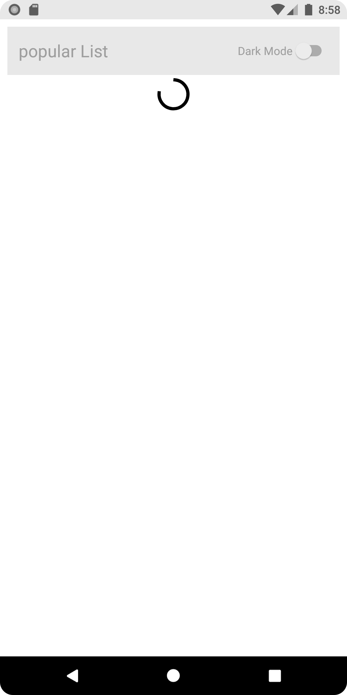
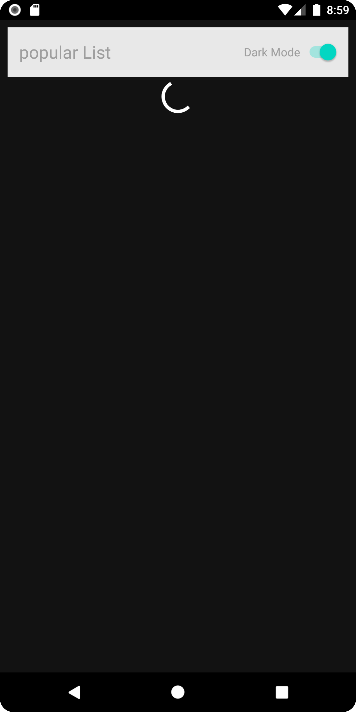
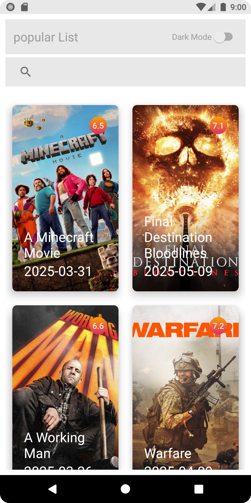
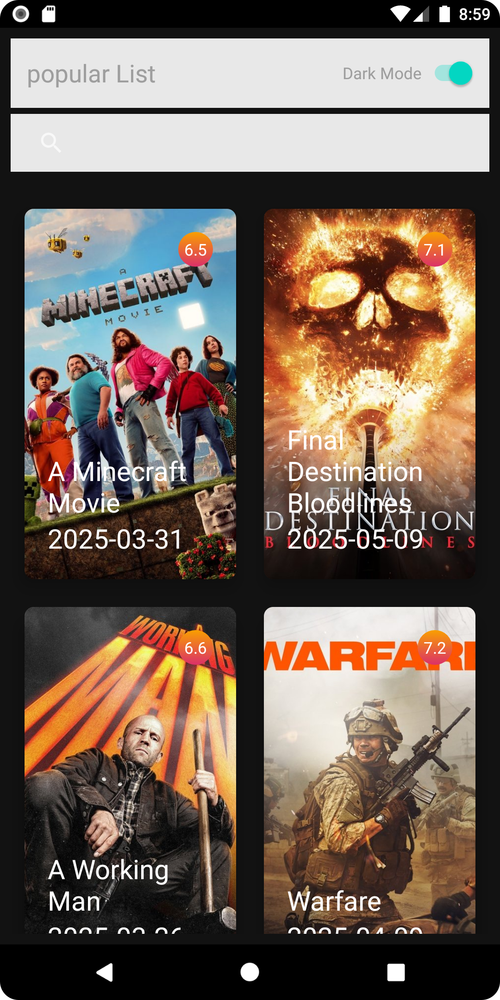
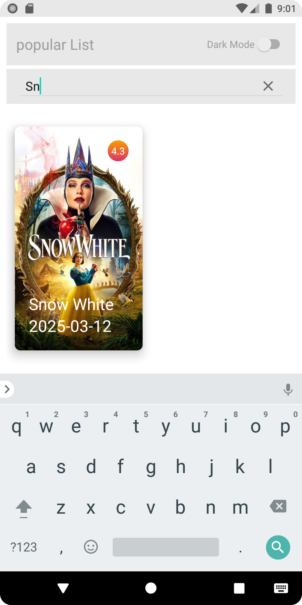

# 🎬 MoviesApp

An Android application built with Kotlin and XML, following Clean Architecture principles.  
The app allows users to browse and search for popular movies from TMDB (The Movie Database) API.

---

## Features

- Browse popular movies
- Search for specific movie
- Dark/Light Mode Switcher

---

## Tech Stack

- Kotlin  
- XML  
- Retrofit  
- Kotlin Flow  
- MVVM Architecture  

| Splash Screen | Progress Bar | Progress Bar (Dark) |
|---------------|--------------|----------------------|
|  |  |  |

| Movies Screen | Movies Screen (Dark) | Search Screen |
|---------------|-----------------------|----------------|
|  |  |  |
